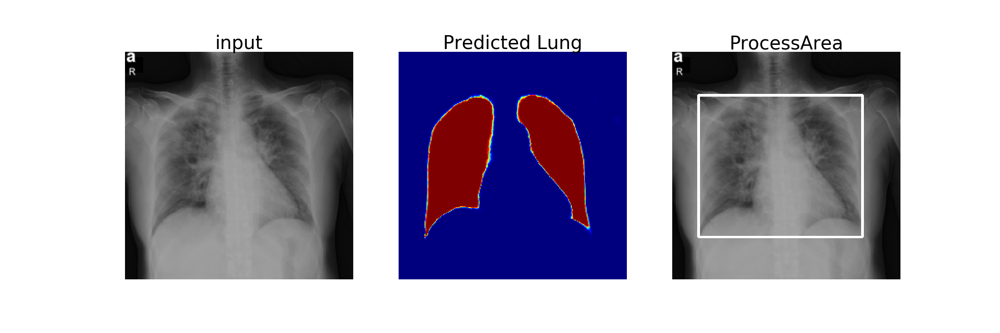

# OSU Lung Segmentation with UNet architecture in X-rays

**MIDRC CRP-2:  Machine intelligence algorithms from multi-modal, multi-institutional COVID-19 data** 
(https://www.midrc.org/midrc-collaborating-research-projects/project-one-crp2)

**Development Team**: S.Candemir (candemirsema@gmail.com)

**Modality**: Chest X-ray

Lung Lobe Segmentation model based on U-Net[1,2]. The model is trained with JSRT data [3] and the corresponding lung masks (SCR data) [4]. The training images are enhanced and re-sized to 256 x 256 before feeding to the network. The model is trained in The Ohio State University Wexner Medical Center, Department of Radiology [5], using Python, Tensorflow Keras API, and trained on an NVIDIA QuadroGV100 system with CUDA/CuDNNv9 dependecies. 


**Requirements**: Python, Tensorflow Keras API, SimpleITK, OpenCV, Numpy, Scikit-image, Matplotlib

**Predict**
```
locate CT sequences in Data folder
>>python lung_segment.py
```

References
---
1)	U-Net: Convolutional Networks for Biomedical Image Segmentation (https://lmb.informatik.uni-freiburg.de/people/ronneber/u-net/)
2)	U-Net Architecture implementation (https://github.com/imlab-uiip/lung-segmentation-2d/tree/master/Demo)
3)	Training Data: JSRT database (http://db.jsrt.or.jp/eng.php)
4)	Training Data: SCR reference lung boundaries (https://www.isi.uu.nl/Research/Databases/SCR/)
5)	Laboratory for Augmented Intelligence in Imaging, The Ohio State University Wexner Medical Center,Department of Radiology
